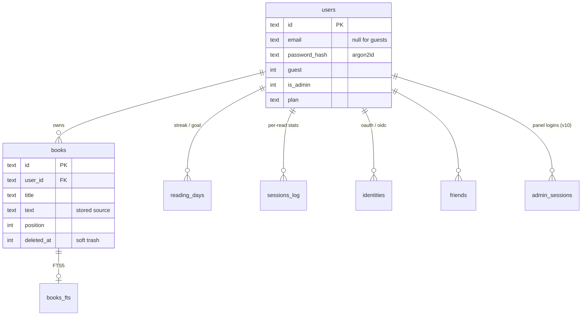
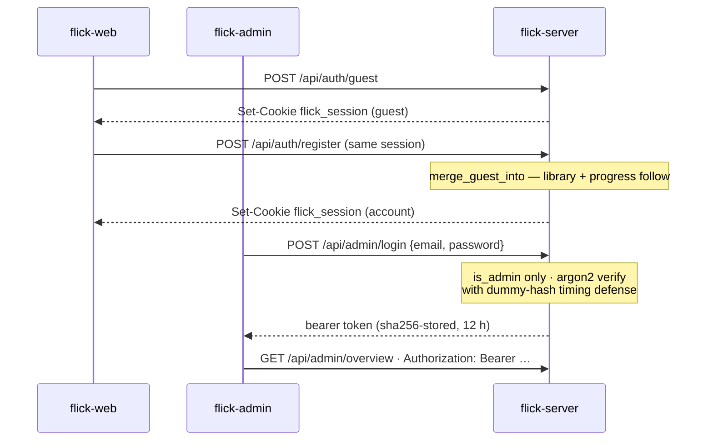

# flick-backend

[](https://github.com/one-more-refactor/flick-backend/actions/workflows/ci.yml)
[](https://github.com/one-more-refactor/flick-backend/releases/latest)
[](https://github.com/one-more-refactor/flick-backend/compare)
[](LICENSE)

The Rust backend for [**flick**](https://github.com/one-more-refactor/flick): the reading engine and the API server. One contract — [`CONTRACTS.md`](https://github.com/one-more-refactor/flick/blob/master/docs/CONTRACTS.md) — every client talks to this API and nothing else.

```
┌──────────────┐   HTTP/JSON (/api)   ┌───────────────────────────┐
│  any client  │ ───────────────────▶ │        flick-server        │
│ web · ext …  │ ◀─────────────────── │  axum · sessions · SQLite  │
└──────────────┘   cookie session     │            │               │
                                       │            ▼               │
                                       │        flick-core          │
                                       │  RSVP · ORP · pacing model │
                                       └───────────────────────────┘
```

**`core/`** (`flick-core`) — the engine. Pure, deterministic, no I/O. It doesn't just flash words, it paces them: ORP pivot alignment, Zipf-frequency weighting (rare words get more time), long-word chunking, wrap-up pauses at clause and sentence ends.

**`server/`** (`flick-server`) — axum + SQLite (bundled rusqlite, WAL, versioned migrations — no external DB). Guest sessions, argon2id passwords, email login codes, OIDC/OAuth; a guest's library **merges** into their new account on signup. Brotli/gzip response compression. IPs pseudonymised before storage; GDPR delete + export are first-class endpoints.

## Data model

One SQLite file (WAL, bundled rusqlite, `PRAGMA user_version` migrations — v10 today). FK cascades make account deletion total:



## Auth, in one picture

Readers use cookie sessions; the admin panel is bearer-only on its own origin:



## Run it

```sh
cargo run --release -p flick-server              # from source
podman build -t flick-backend -f deploy/Containerfile .   # prod image (web client baked in)
```

Self-hosting everything is one command — see [**flick › Self-hosting**](https://github.com/one-more-refactor/flick#self-hosting).

## Configuration

Environment variables (full list in [`CONTRACTS.md`](https://github.com/one-more-refactor/flick/blob/master/docs/CONTRACTS.md)):

| Variable | Default | Purpose |
|---|---|---|
| `FLICK_EDITION` | `selfhost` | `selfhost` (all free) or `hosted` |
| `FLICK_ADDR` | `0.0.0.0:8484` | bind address |
| `FLICK_DATA_DIR` | `./data` | SQLite lives here |
| `FLICK_PUBLIC_URL` | `http://localhost:8484` | canonical URL |
| `FLICK_WEB_DIST` | auto | built web client, served at `/` |
| `FLICK_SMTP_URL` | — | login-code email; unset = codes logged |
| `FLICK_OIDC_*`, `FLICK_OAUTH_*` | — | SSO providers |
| `FLICK_ADMIN_TOKEN` | — | enables admin endpoints |

## Verify

```sh
cargo test --workspace && cargo clippy --all-targets -- -D warnings
```

Releases: bump the crate versions, tag `vX.Y.Z`, push the tag — CI verifies tag = manifest, runs the suite, and publishes the release.

## License

[AGPL-3.0-only](LICENSE). Run a modified network service → offer users its source (§13).
